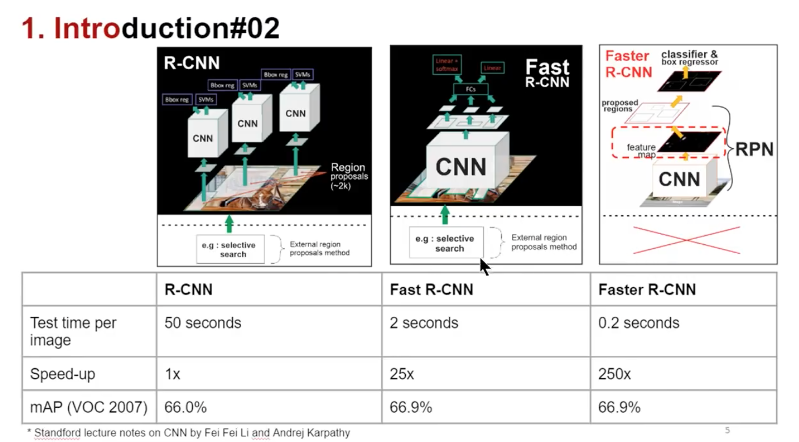

# Mask-RCNN
A collection of notes, code snips for Mask-RCNN
Ado
##### Outline  
[Basics related concepts](#basic_concepts)  
[A brief history](#history)  
xxx
x
xxxx

x
x
x
x
x
x
x
x
x
x
x

## Basics concepts<a name='basic_concepts'/>
### Pytorch  
We will you Pytorch for implementation of our Mask-RCNN, thus if you are newbie, the following tutorials might be helpfull for you to start.
  * This tutor discribes very well how to make a FCN network in Pytorch and apply for MNIST [link](http://adventuresinmachinelearning.com/pytorch-tutorial-deep-learning/)

## A brief history<a name='history'/>

## References  
https://ardianumam.wordpress.com/2017/12/16/understanding-how-mask-rcnn-works-for-semactic-segmentation/  
https://www.youtube.com/watch?v=cSO1nUj495Y&t=90s  
