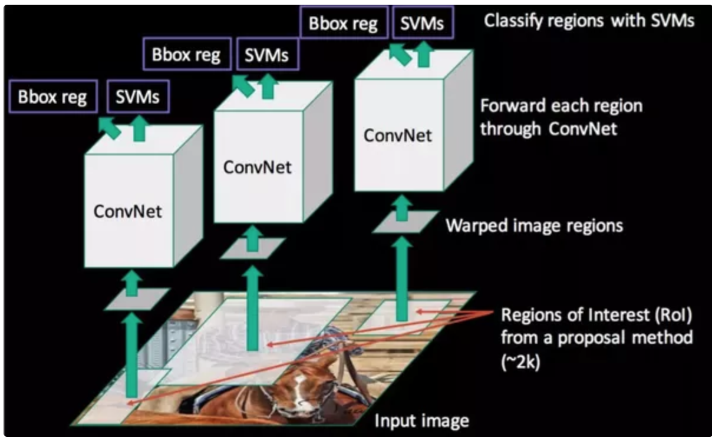
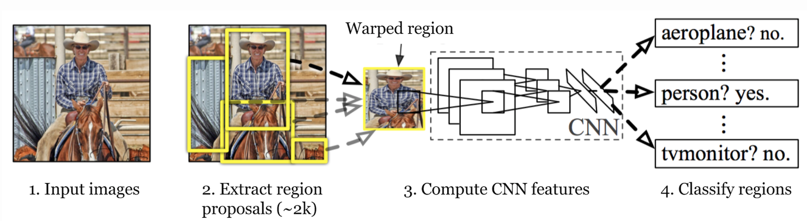

# Mask-RCNN
A collection of notes, code snips for Mask-RCNN
Ado
##### Outline  
[Basics related concepts](#basic_concepts)  
[A brief history](#history)  

x
x
x
x
x
x
x
x
x
x
x

## Basics concepts<a name='basic_concepts'/>
### Pytorch  
We will you Pytorch for implementation of our Mask-RCNN, thus if you are newbie, the following tutorials might be helpfull for you to start.
  * This tutor discribes very well how to make a FCN network in Pytorch and apply for MNIST [link](http://adventuresinmachinelearning.com/pytorch-tutorial-deep-learning/)

### Selective search <a name='selective_search'/>
Grouping pixels into regions based on the similarity. The metric for similarity can be color,texture, size, shape etc.. (e.g HOG). The grouping is done hiearchically, from pixles to small regions, then mering small regions to larger regions. This was explained very well in this [slide](./asses/docs/selective_search_stanford_vision.pdf)

### Bounding box regressor <a name='bbox_reg'>
Using NN or SVM with the input is the extracted feature to regress the bounding box(BB) around ROI to make the more precise (localize more
precise around object).

## A brief history<a name='history'/>

### R-CNN

**Work flow**
 * Detect ROI using [selective search](#selective_search) 
 * Extract features for each ROI using a CNN (can be pre-trained model,e.g VGG, ResNet ...)
 * Classify using SVM
 * Tighten/correct the bounding box (ROI) using a Box regressor

---

## References  
https://ardianumam.wordpress.com/2017/12/16/understanding-how-mask-rcnn-works-for-semactic-segmentation/  
https://www.youtube.com/watch?v=cSO1nUj495Y&t=90s  
[Very good explaination (and beautiful blo)](https://lilianweng.github.io/lil-log/2017/12/31/object-recognition-for-dummies-part-3.html#r-cnn)
